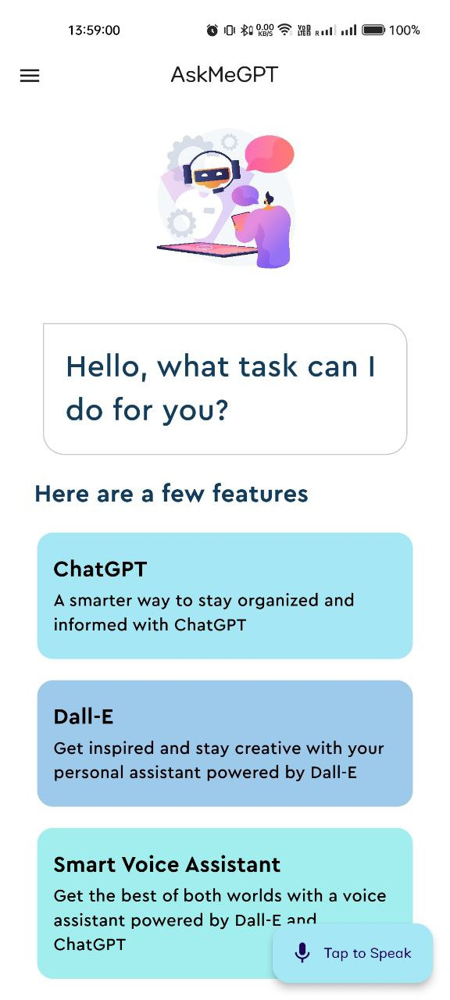
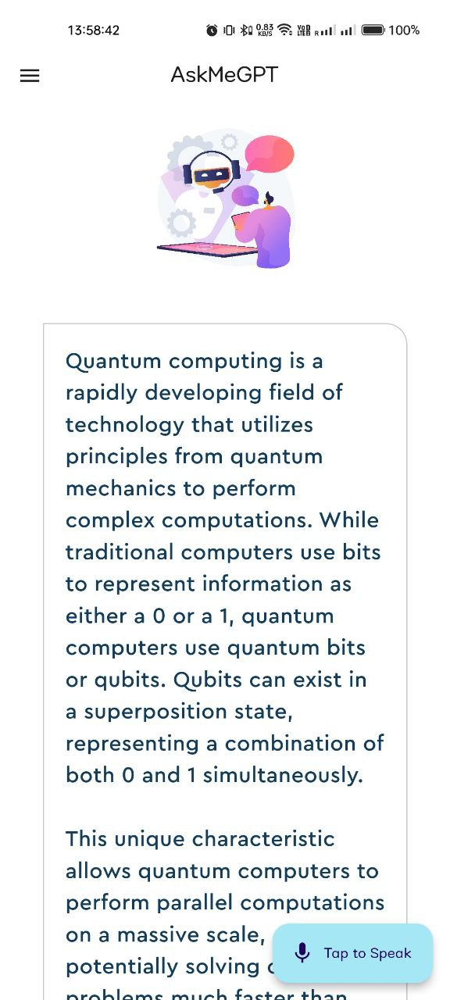
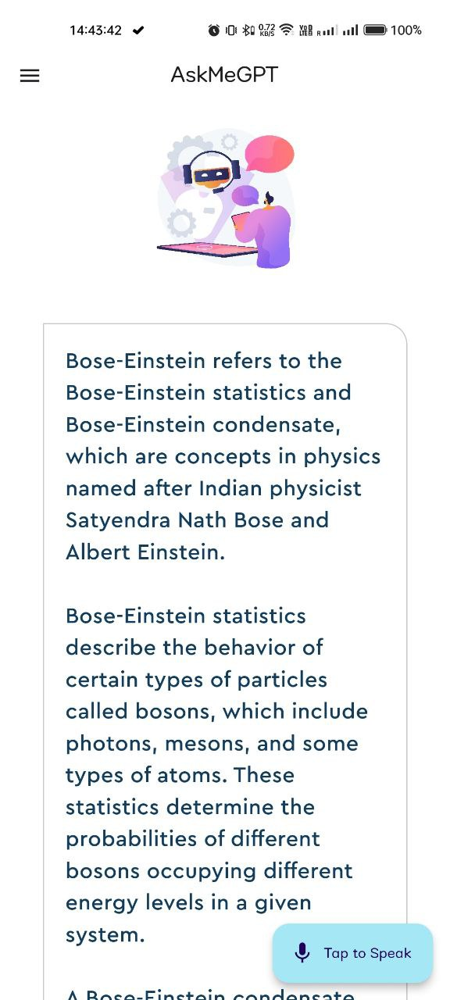
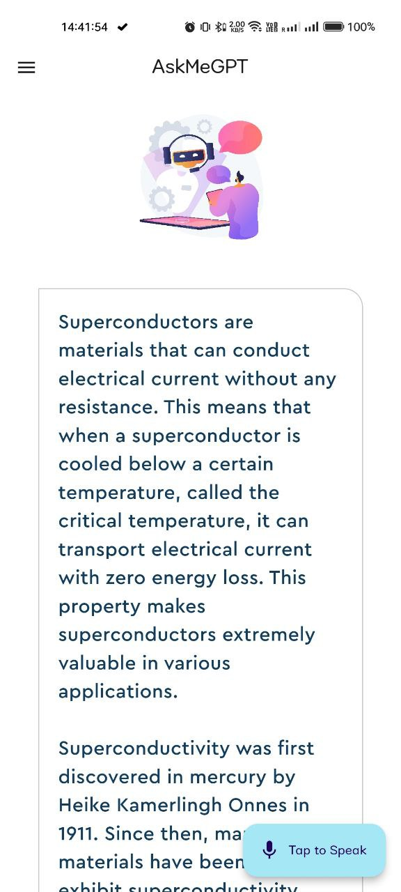
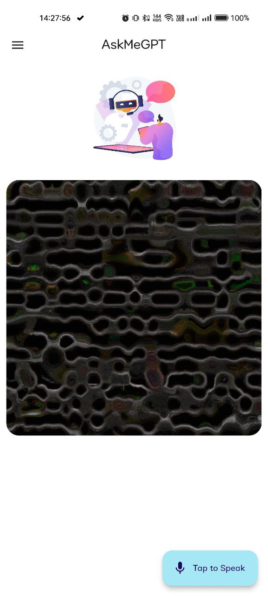
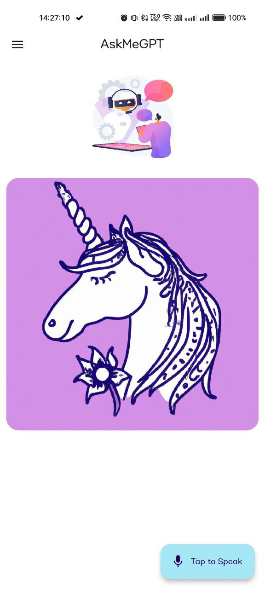
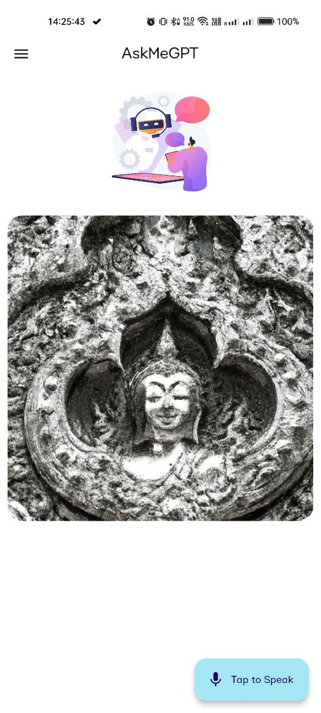
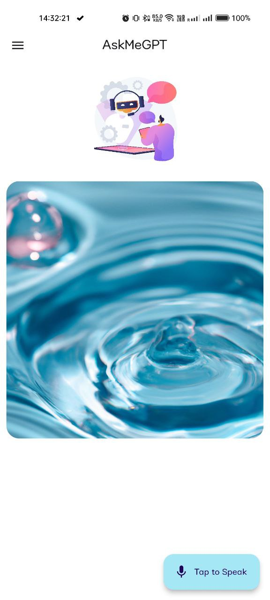

<h1 align="center"> 
   </br>
  
</h1>


# A Simple easy-to-use Voice Assistant App to ask questions, get information or generate beatufil images !

## ✨ Features
* No Sign In required.
* No need to type long questions in ChatGPT. Just ask by clicking on the mic.
* Automated classification whether the inpput speech asks to generate image or requires text as an answers.
* For Image/Art generation, Dall-E API is used to create wonderful images.
* For Text-based Queries, ChatGPT API is used to give context-based answers on all the questions.
* Speech gets converted to Text and is sent to APIs. The received message is displayed as text and even spoken by the virtual assistant.
* Simple User-Friendly UI for Text and Image generation. 

## ⚙️ Tech-Stack
The application is built entirely with Flutter and powered by ChatGPT and Dall-E. 

## 🏃🏻 Getting Started
### Prerequisites:
* Get Flutter up and running. For this purpose visit - [Flutter docs](https://flutter.dev/docs/get-started/install).

### Building from source:
* If you are using an IDE like [Android Studio](https://developer.android.com/studio), you may use suitable GUI/hotkeys. Here is how you can work things from the terminal.

    ```
    git clone https://github.com/jash-desai/AskMeGPT.git
    cd AskMeGPT
    cd askme
    flutter run
    ```

### Screenshots:
* All Screens 

Screen 1  |  Screen 2  | Screen 3 | Screen 4
:-------------------------:|:-------------------------:|:-------------------------:|:-------------------------:
|||

Screen 5 | Screen 6 | Screen 7| Screen 8
:-------------------------:|-------------------------:|-------------------------:|-------------------------:
| ||


### Feedback:
* If you have any feedback, please reach out to us at jashkdesai@gmail.com
</br>
